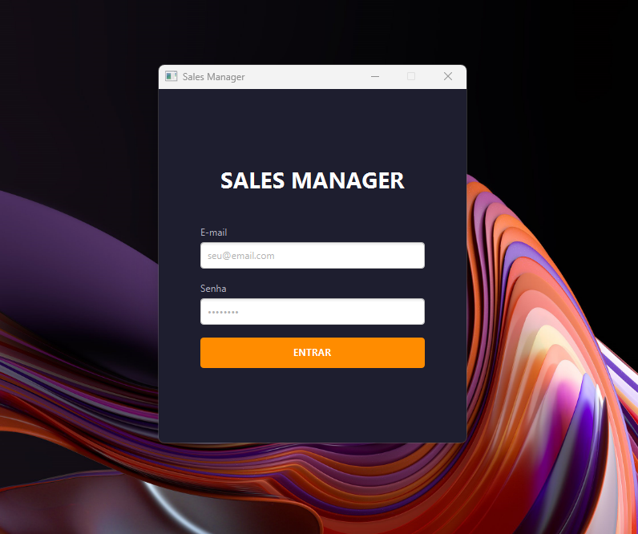
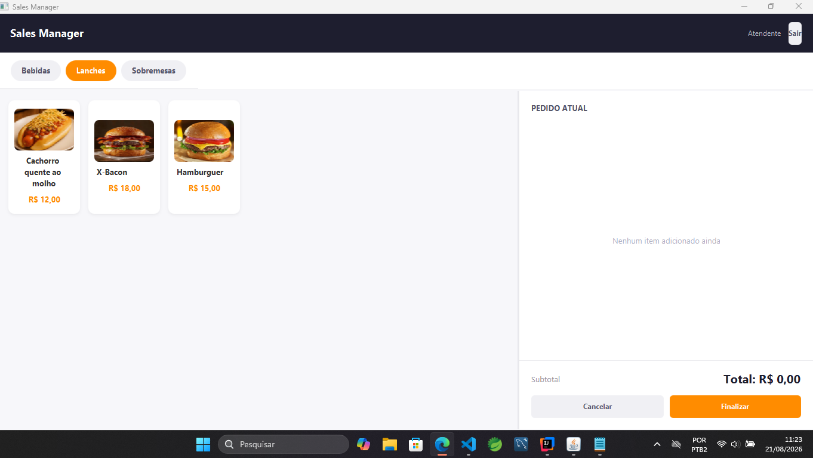
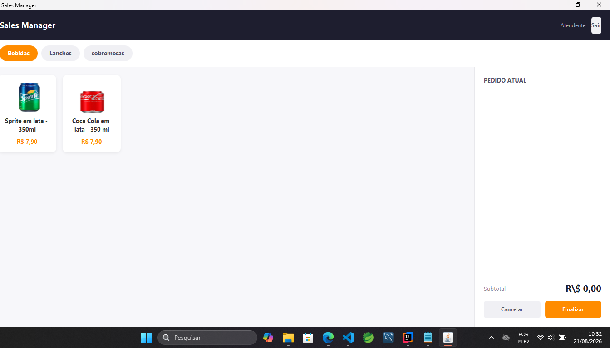
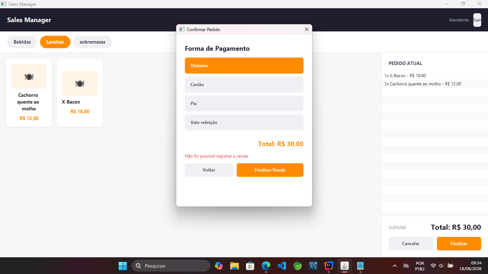
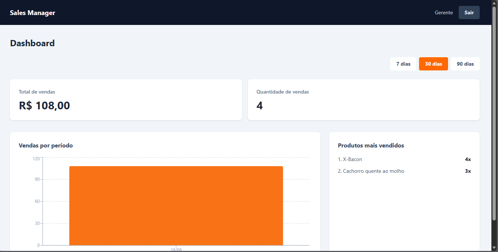
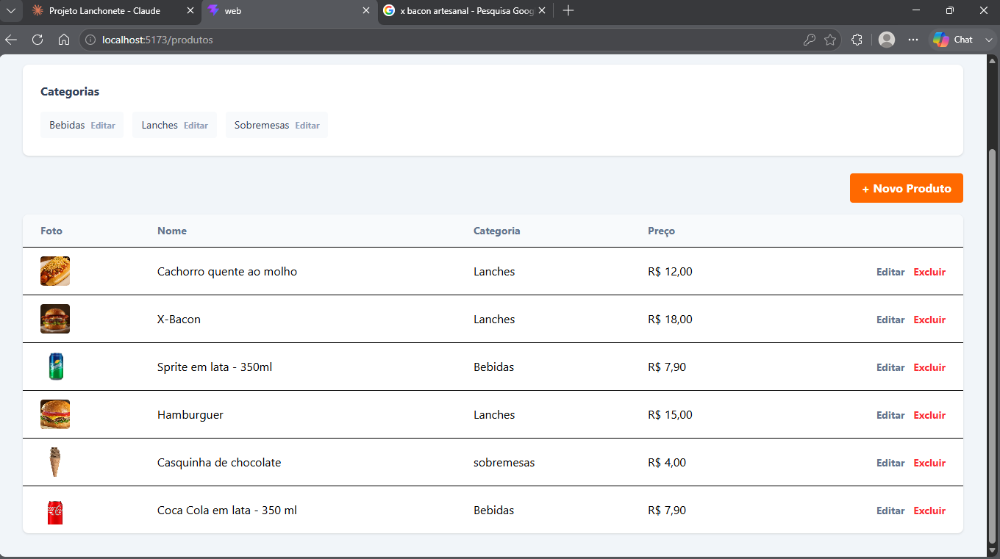
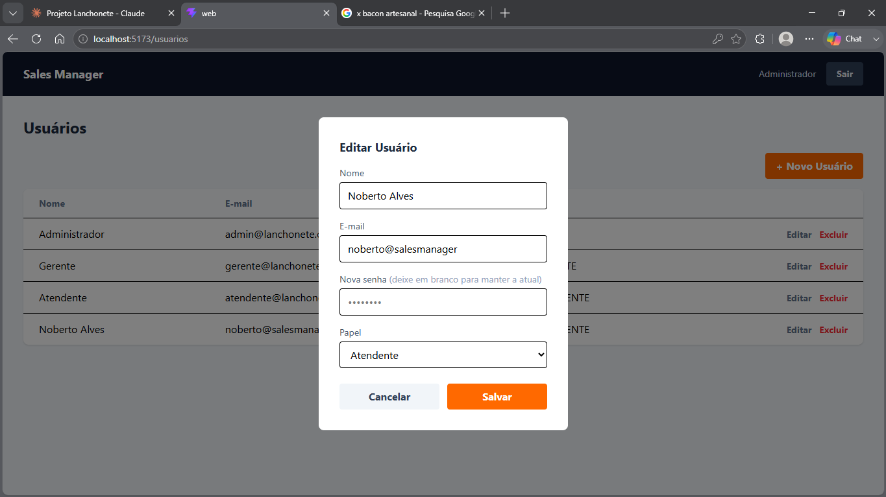

# 🍔 Sales Manager

Sistema de ponto de venda para lanchonete, com aplicativo desktop para operação de vendas e painel web para administração, cadastro de produtos e acompanhamento de resultados.

O projeto é dividido em três aplicações independentes que se comunicam com um backend REST único:

| Aplicação | Tecnologia | Público |
|---|---|---|
| **Backend** | Java 21 + Spring Boot | API central |
| **Desktop** | JavaFX | Atendente (ponto de venda) |
| **Web** | React + TypeScript | Administrador e Gerente |

---

## 📖 Visão geral

O sistema tem três perfis de acesso, cada um com seu próprio fluxo:

- **Administrador** (web) — cadastra e gerencia Gerentes e Atendentes.
- **Gerente** (web) — cadastra produtos e categorias (com foto), acompanha o dashboard de vendas (total, gráfico por período, produtos mais vendidos).
- **Atendente** (desktop) — realiza vendas: monta o pedido, confirma os itens e finaliza com a forma de pagamento.

O backend concentra toda a regra de negócio e o acesso ao banco de dados — o desktop e a web nunca acessam o banco diretamente, ambos consomem a mesma API REST autenticada.

```
                          MySQL
                            │
                    Backend (Spring Boot)
                            │
                    API REST autenticada
                            │
             ┌──────────────┴──────────────┐
             │                             │
     Desktop (JavaFX)                 Web (React)
     Exclusivo para vendas       Administrador: usuários
                                  Gerente: produtos + dashboard
```

---

## 🖼️ Screenshots

### Desktop — Atendente

| Login | Tela de Pedido |
|---|---|
|  |  |

| Carrinho com fotos dos produtos | Forma de pagamento |
|---|---|
|  |  |

### Web — Administrador e Gerente

| Dashboard do Gerente | Cadastro de Produtos |
|---|---|
|  |  |

| Edição de Usuário |
|---|
|  |

---

## ✨ Funcionalidades

### Backend (API)
- Autenticação via **JWT**, com token expirando em 8h
- Controle de acesso por papel (`@PreAuthorize`) — cada endpoint só aceita o perfil correto
- Senhas protegidas com hash **BCrypt** (nunca trafegam nem são armazenadas em texto puro)
- Validação de dados (Bean Validation) e tratamento de erros centralizado, com respostas HTTP semânticas
- Banco de dados versionado com **Flyway** (migrations)
- Upload de imagem de produto, servido como recurso estático
- Endpoint agregado de dashboard (total de vendas, vendas por dia, produtos mais vendidos) com queries otimizadas

### Desktop (Atendente)
- Login com bloqueio por papel (só atendentes acessam)
- Tela de pedido responsiva, com categorias em abas, cards de produto com foto, e carrinho fixo lateral
- Controle de item por item no carrinho (adicionar, remover uma unidade, cancelar pedido com confirmação)
- Fluxo de fechamento em modal: confirmação dos itens → escolha da forma de pagamento (Dinheiro, Cartão, Pix, Vale-refeição)
- Tratamento de falha de conexão com o servidor (aviso visual + botão "tentar novamente")
- Detecção de sessão expirada, com redirecionamento automático ao login
- Cache de imagem por produto, evitando recarregamentos desnecessários

### Web (Administrador e Gerente)
- Login com bloqueio por papel (administrador e gerente, não atendente)
- **Administrador:** CRUD de usuários (criar, editar com reset de senha opcional, excluir), com confirmação de senha
- **Gerente:** CRUD de produtos (com upload e preview de foto) e categorias, dashboard com cards de indicadores, gráfico de vendas por período e ranking de produtos mais vendidos
- Notificações *toast* de sucesso/erro em todas as ações
- Paginação nas tabelas de listagem

---

## 🛠️ Stack técnica

### Backend
- Java 21, Spring Boot, Spring Web, Spring Data JPA, Spring Security
- MySQL 8
- Flyway (migrations)
- JWT (jjwt)
- Maven

### Desktop
- Java 21, JavaFX (Scene Builder / FXML)
- Cliente HTTP nativo (`java.net.http.HttpClient`)
- Jackson (serialização JSON)
- Maven + javafx-maven-plugin

### Web
- React 19 + TypeScript
- Vite
- Tailwind CSS
- TanStack React Query (dados/cache da API)
- React Router
- Recharts (gráficos do dashboard)
- Axios

---

## 🏗️ Arquitetura

Todas as três aplicações seguem o mesmo padrão em camadas:

```
Controller / Componente
        ↓
    Service              ← lógica de negócio / orquestração
        ↓
Repository / ApiClient    ← acesso a dados (banco ou HTTP)
```

No backend, a regra de negócio nunca fica presa aos Controllers, e a autenticação do usuário é resolvida a partir do token JWT (nunca confiando em dados enviados pelo cliente, como `usuarioId`). No desktop e na web, o cliente HTTP centraliza a injeção do token e o tratamento de erros, mantendo os componentes de tela livres dessa responsabilidade.

---

## 📂 Modelo de dados

| Entidade | Descrição |
|---|---|
| `usuario` | Administrador, Gerente ou Atendente (papel controla permissões) |
| `categoria` | Agrupamento de produtos (ex: Lanches, Bebidas, Sobremesas) |
| `produto` | Nome, descrição, preço, categoria e foto opcional |
| `venda` | Registro de venda, com forma de pagamento e atendente responsável |
| `item_venda` | Itens de uma venda (produto, quantidade, preço no momento da venda) |

---

## 🚀 Como rodar o projeto

### Pré-requisitos
- Java 21
- Node.js 18+
- MySQL 8+
- Maven (ou usar o `mvnw` incluso)

### 1. Banco de dados

Crie o banco (as tabelas são criadas automaticamente pelo Flyway na primeira execução):

```sql
CREATE DATABASE sales_manager
    DEFAULT CHARACTER SET utf8mb4
    DEFAULT COLLATE utf8mb4_unicode_ci;
```

### 2. Backend

```bash
cd backend
cp src/main/resources/application.properties.example src/main/resources/application.properties
```

Edite `application.properties` com suas credenciais do MySQL. Depois:

```bash
./mvnw spring-boot:run
```

A API sobe em `http://localhost:8080`.

### 3. Desktop

```bash
cd desktop
mvn javafx:run
```

### 4. Web

```bash
cd web
npm install
npm run dev
```

A aplicação web sobe em `http://localhost:5173`.

---

## 🔒 Segurança

- Senhas com hash BCrypt, nunca expostas em nenhuma resposta da API
- Token JWT com expiração e validação por papel em cada requisição
- Endpoints protegidos por `@PreAuthorize`, restringindo ação por perfil de usuário
- Segredo do JWT configurável via variável de ambiente (`JWT_SECRET`), com valor de desenvolvimento apenas como *fallback*
- CORS restrito à origem do frontend web
- Validação de entrada em todos os endpoints que recebem dados do cliente

---

## 🗺️ Roadmap / possíveis evoluções

- Controle de estoque
- Cancelamento de vendas já finalizadas
- Relatórios exportáveis (PDF/Excel)
- Testes automatizados

---

## 👤 Autor

Desenvolvido por **William dos Santos Rodrigues**.